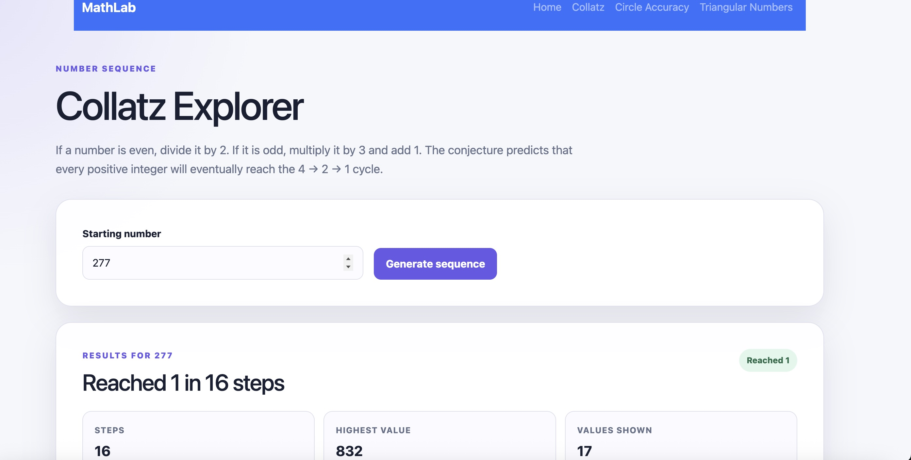
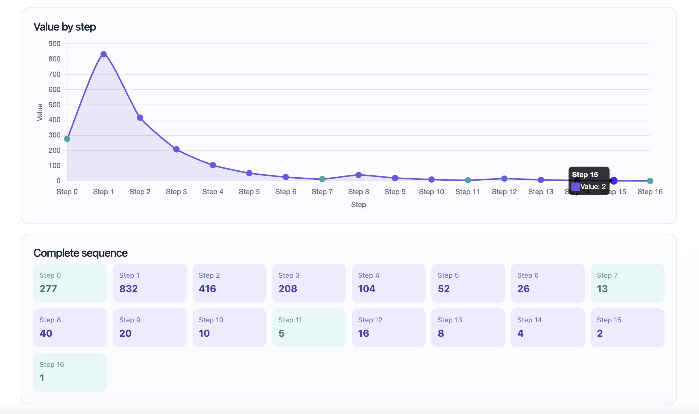
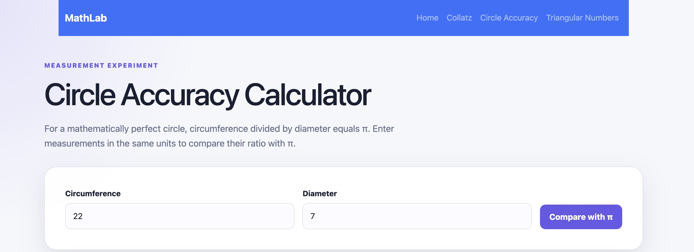
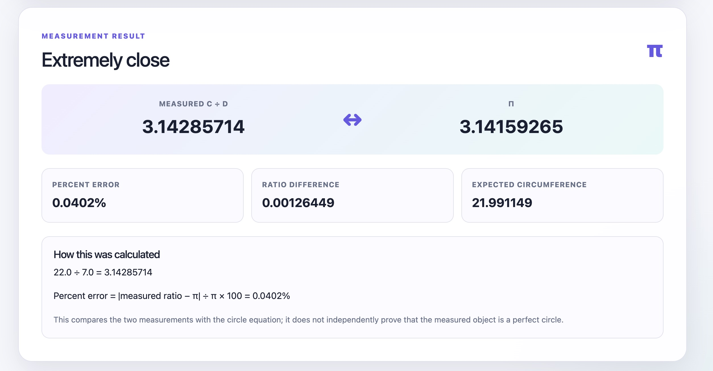
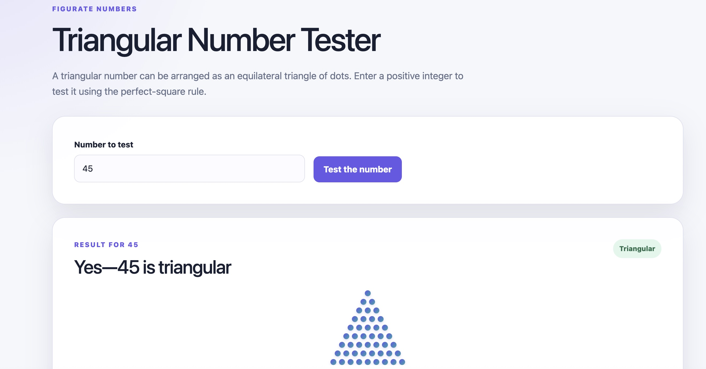
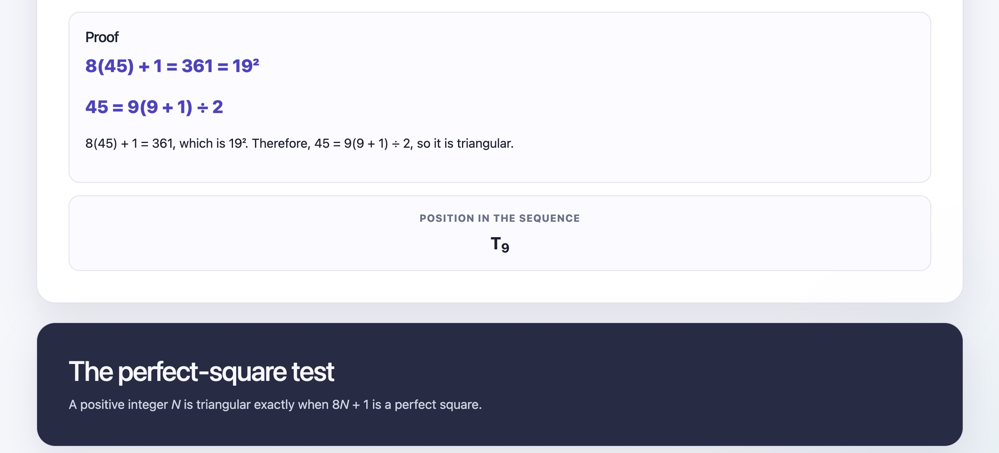

# Cool Math Lab
#### A mathematical tool for demonstrating certain numerical phenomena
#### Video Demo
🚀 **[Launch Cool Math Lab](https://youtu.be/rTceheu_2so)**
## Features

## Collatz Calculation
#### The Collatz Conjecture is the idea that when you follow a certain pattern, every single number will always end up in the same place. If a number is even, you are to divide it by two and if it is odd, you are to multiply the number by three and add one. The idea is that no matter the number, the pattern will always end in a 4-2-1 loop. The conjecture has never been disproven and it is a very interesting way of displaying the beauty in mathematics. This website will do up to 100 steps of the pattern and graph each of them, either proving the conjecture to be true or displaying the idea that eventually the numbers will get small enough to enter the 4-2-1 loop.

## Perfect Circle
#### Pi is a concept that is sometimes difficult for people to understand, even those who do math with it everyday. This website helps you understand what pi is and what a perfect circle is. The software takes a circumference and a diameter as inputs, and calculates and compares the ratio of them to pi. Not only does this display the meaning of pi, the ratio of circumference to diameter, it can also help with drawing or construction projects where something needs to be circular.

## Triangular Numbers
#### - A triangular number is a number that is the sum of a count that makes up an equilateral triangle. The first four are 1,3,6,10. 1+2+3+4 = 10 and 1+2+3 = 6, making them triangular. Triangular numbers are used in all kinds of everyday applications such as figuring out how many unique pairings there are in a group or object racking. Additionally there are important mathematical connections between triangular, square, and pentagonal numbers. This website takes any integer as an input and tells you if it is triangular, and if it is it will also tell you which triangular number it is i.e. 10 is the fourth triangular number and so on.

## Images
## Home Page


## Collatz Conjecture




## Circle Comparison




## Triangular Numbers





## Running MathLab Locally

#### Follow these steps to run MathLab on your computer.

### 1. Download the project

#### Clone the repository:

#### ```bash
#### git clone https://github.com/YOUR-USERNAME/coolmathexplorer.github.io.git
#### ```

#### Replace `YOUR-USERNAME` with your GitHub username.

#### Enter the project folder:

#### ```bash
#### cd coolmathexplorer.github.io
#### ```

#### You can also download the repository as a ZIP file from GitHub and extract it.

### 2. Create a virtual environment

#### Create the environment:

#### ```bash
#### python3 -m venv .venv
#### ```

#### Activate it on macOS or Linux:

#### ```bash
#### source .venv/bin/activate
#### ```

#### Activate it on Windows PowerShell:

#### ```powershell
#### .venv\Scripts\Activate.ps1
#### ```

### 3. Install the required packages

#### ```bash
#### python -m pip install -r requirements.txt
#### ```

### 4. Run MathLab

#### ```bash
#### python app.py
#### ```

#### If your computer uses `python3`, run:

#### ```bash
#### python3 app.py
#### ```

#### The terminal should display an address similar to:

#### ```text
#### http://127.0.0.1:5000
#### ```

#### Open that address in your browser.

### 5. Stop MathLab

#### Return to the terminal and press:

#### ```text
#### Ctrl+C
#### ```

## Troubleshooting

#### If you receive the following error:

#### ```text
#### ModuleNotFoundError: No module named 'flask'
#### ```

#### Install Flask:

#### ```bash
#### python -m pip install Flask
#### ```

#### If styling or JavaScript changes do not appear, force-refresh the page:

#### - macOS: `Command + Shift + R`
#### - Windows: `Ctrl + Shift + R`

#### Always open MathLab using the Flask address displayed in the terminal. Do not open the HTML files directly.

## Why I Made This Project
#### I made this project simply because I thought it would be interesting. I was doing some reading on common mathematical phenomena and I felt that these were simple ideas I wish I had known about sooner. Understanding these patterns and ideas brings to light a different facet of the importance of mathematics beyond just calculations for the purpose of building and making things. Making this project has helped me gain a better understanding for patterns and algorithms as well as helped me visualize math that can be difficult to visualize by hand.

## Author

#### Gabriella Gordon

#### Materials Science student interested in research and development, biomedical materials, nanoparticle characterization, and scientific software.
#### GitHub: ggordon4810
#### LinkedIn: [Gabriella Gordon](https://www.linkedin.com/in/gabriella-gordon-1a7b2536a/)
